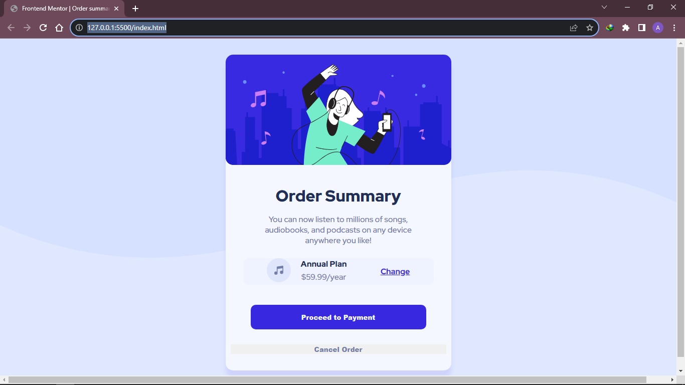
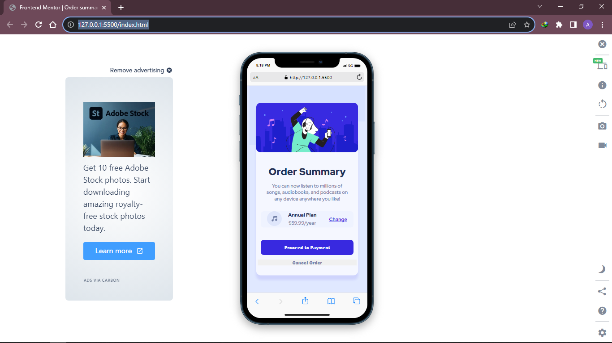

## Table of contents

- [Overview](#overview)
  - [The challenge](#the-challenge)
  - [Screenshot](#screenshot)
  - [Links](#links)
- [My process](#my-process)
  - [Built with](#built-with)
  - [What I learned](#what-i-learned)

## Overview

### The challenge

Users should be able to:

- See hover states for interactive elements
- View the optimal layout depending on their device's screen size

### Screenshot

### Links

- Live Site URL: [Add live site URL here](https://component-order-summary-project.netlify.app/)

## My process

### Built with

- Semantic HTML5 markup
- CSS3
- Flexbox

## Author

- Frontend Mentor - [@pajarmuharam14](https://www.frontendmentor.io/profile/pajarmuharam14)
- Twitter - [@pajarmuharam00](https://twitter.com/pajarmuharam00)
